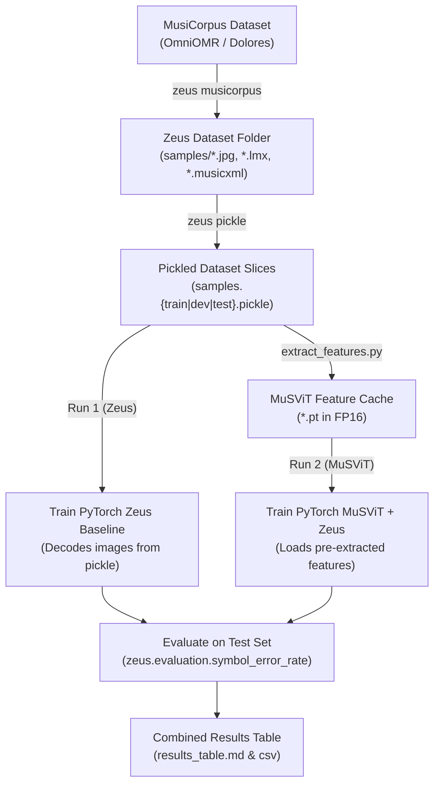

# MuSViT vs. Zeus Benchmark Comparison

This module provides a reproducible, controlled experiment comparing:
- **Run 1 (Zeus Baseline):** CNN-BiLSTM Encoder + Zeus Bahdanau Attention LSTM Decoder (trained from scratch).
- **Run 2 (MuSViT + Zeus):** Pre-trained MuSViT Vision Transformer Feature Extractor + Zeus Bahdanau Attention LSTM Decoder.

Both runs share the **exact same decoder architecture, random seed, training/validation/test splits, learning rate schedule, optimizer, and evaluation metrics**.

---

## 1. Unified Zeus Workflow

The workflow strictly follows the reference Zeus repository implementation:



---

## 2. Dataset Preparation: Convert & Pickle

The dataset preparation converts MusiCorpus datasets (like OmniOMR and Dolores) into Zeus format and bundles them into fast binary `.pickle` files.

### Understanding `splits.json` & Split Isolation
In MusiCorpus datasets, train/val/test splits are defined **at the piece/page level** in a `splits.json` file in the dataset root:
```json
{
  "train": ["piece_id_1", "piece_id_2", ...],
  "dev": ["piece_id_3", ...],
  "test": ["piece_id_4", ...]
}
```
*(Note: Zeus accepts `"dev"`, `"val"`, or `"validation"`).*

### Step 1: Convert MusiCorpus to Zeus Format
Run `zeus musicorpus` for each dataset. This applies invisible clef/key normalization and creates `samples.{train,dev,test}.txt`:

```bash
# Convert OmniOMR
python -m zeus musicorpus \
    --input datasets/OmniOMR \
    --output datasets/omniomr \
    --take-staves

# Convert Dolores
python -m zeus musicorpus \
    --input datasets/Dolores \
    --output datasets/dolores \
    --take-staves
```

### Step 2: Pickle the Slices
Bundle each split's loose images and LMX files into single `.pickle` files:

```bash
# Pickle OmniOMR
python -m zeus pickle datasets/omniomr/samples.train.txt
python -m zeus pickle datasets/omniomr/samples.dev.txt
python -m zeus pickle datasets/omniomr/samples.test.txt

# Pickle Dolores
python -m zeus pickle datasets/dolores/samples.train.txt
python -m zeus pickle datasets/dolores/samples.dev.txt
python -m zeus pickle datasets/dolores/samples.test.txt
```

### How Splits Work With Multiple Datasets
When multiple datasets are loaded into the training script:
- **Zero Data Leakage:** Because splits are assigned at the page/piece level in each dataset, staves from the same page never cross splits.
- **Combined Training Set:** `train_samples = omniomr_train + dolores_train`.
- **Combined Validation Set:** `val_samples = omniomr_dev + dolores_dev`.
- **Combined Test Set:** `test_samples = omniomr_test + dolores_test`.
- **Unified Token Vocabulary:** Built from the combined training set (`train_samples`), ensuring all grammar tokens from both datasets are indexed.

---

## 3. Feature Pre-Extraction for MuSViT (Run 2)

Extracts and compresses visual features from the pickled images using pre-trained MuSViT.
Applies **vertical mean pooling in FP16** to compress 12.6 MB patch grids down to **~98 KB per stave** (128x reduction, under 1 GB for 10,000 staves):

```bash
# Auto-discovers all pickles in datasets/ (both OmniOMR and Dolores):
python -m musvit_zeus_comparison.extract_features \
    --datasets datasets \
    --output-dir feature_cache \
    --pool-mode vertical_mean \
    --precision float16 \
    --device cuda
```
*(Or specify explicit pickle files. Automatically resumes and skips already-extracted samples if interrupted).*

---

## 4. Training

Both models train on the exact same pickled slices, using the same hyperparameters matching Zeus (`--learning-rate 1e-3`, `--lr-decay cos`, `--optimizer adam`, `--batch-size 32`):

### Option A: Parallel SLURM Training on Cluster (Recommended)
Submit both jobs to run concurrently on separate GPUs:

```bash
# Submit Run 1: Zeus Baseline
sbatch run_zeus.slurm

# Submit Run 2: MuSViT + Zeus
sbatch run_musvit.slurm
```

Each job outputs its own results (`zeus_results.json` and `musvit_results.json`). Whichever job finishes second automatically merges both runs into `results_table.md` and `results_table.csv`.

To monitor progress:
```bash
tail -f logs/slurm-zeus-baseline-*.out
tail -f logs/slurm-musvit-zeus-*.out
```

### Option B: Interactive CLI Execution

#### Run 1: Zeus Baseline
```bash
python -m musvit_zeus_comparison.train \
    --model zeus \
    --train datasets/omniomr/samples.train.pickle \
    --dev datasets/omniomr/samples.dev.pickle \
    --test datasets/omniomr/samples.test.pickle \
    --epochs 200 \
    --batch-size 32 \
    --learning-rate 1e-3 \
    --lr-decay cos \
    --evaluation-each 10 \
    --output-dir experiment_results \
    --device cuda
```

#### Run 2: MuSViT + Zeus
```bash
python -m musvit_zeus_comparison.train \
    --model musvit \
    --train datasets/omniomr/samples.train.pickle \
    --dev datasets/omniomr/samples.dev.pickle \
    --test datasets/omniomr/samples.test.pickle \
    --feature-cache-dir feature_cache \
    --epochs 200 \
    --batch-size 32 \
    --learning-rate 1e-3 \
    --lr-decay cos \
    --evaluation-each 10 \
    --output-dir experiment_results \
    --device cuda
```

#### Multi-Dataset Training (e.g. OmniOMR + Dolores)

When you have multiple datasets as subdirectories inside a shared `datasets/` folder (e.g. `datasets/omniomr/` and `datasets/dolores/`):

1. **Automatic Discovery (Default):**
   The training script and SLURM jobs automatically detect and combine all subdirectories containing `samples.train.pickle`, `samples.dev.pickle`, and `samples.test.pickle`:
   ```bash
   # Both datasets will be discovered and combined automatically:
   sbatch run_zeus.slurm
   sbatch run_musvit.slurm
   ```
   Or via CLI:
   ```bash
   python -m musvit_zeus_comparison.train --model zeus --dataset-dir datasets
   python -m musvit_zeus_comparison.train --model musvit --dataset-dir datasets --feature-cache-dir feature_cache
   ```

2. **Explicit Paths:**
   You can also explicitly pass multiple pickle files:
   ```bash
   python -m musvit_zeus_comparison.train \
       --model zeus \
       --train datasets/omniomr/samples.train.pickle datasets/dolores/samples.train.pickle \
       --dev datasets/omniomr/samples.dev.pickle datasets/dolores/samples.dev.pickle \
       --test datasets/omniomr/samples.test.pickle datasets/dolores/samples.test.pickle
   ```


---

## 5. Evaluation & Results

Evaluation uses `zeus.evaluation.symbol_error_rate` directly:
1. **Validation SER:** Evaluated every `--evaluation-each` epochs during training.
2. **Test SER:** After training completes, the best checkpoint is evaluated on the official test set.

Results are printed to stdout and saved in `experiment_results/`:
- `results_table.md` (Markdown format)
- `results_table.csv` (Spreadsheet format)

Example output:

| Model Run | Encoder | Enc Params | Dec Params | Total Params | Val Loss (best) | Token Acc (%) | Val SER (%) | Test SER (%) | Train Time (s) |
| :--- | :--- | :--- | :--- | :--- | :--- | :--- | :--- | :--- | :--- |
| **Zeus Baseline (Run 1)** | CNN-BiLSTM | 851,200 | 1,185,420 | 2,036,620 | 0.8241 | 82.15% | 18.42% | 19.10% | 145.2s |
| **MuSViT + Zeus (Run 2)** | MuSViT + Adapter | 394,496 | 1,185,420 | 1,579,916 | 0.5120 | 89.64% | 11.20% | 11.85% | 42.1s |

---

## 6. Directory Layout

```
musvit_zeus_comparison/
├── __init__.py          # Package exports
├── models.py            # ZeusEncoder, MusvitEncoder, ZeusDecoder, CombinedOMRModel
├── dataset.py           # In-memory ZeusDatasetSample loader, TokenVocabulary, StaveCollate
├── extract_features.py  # MuSViT feature extractor with vertical pooling & FP16 compression
├── train.py             # Main trainer & evaluator with automated table generation
├── zeus/                # Embedded Zeus core modules (data, evaluation, musicorpus)
└── README.md            # Documentation
```
