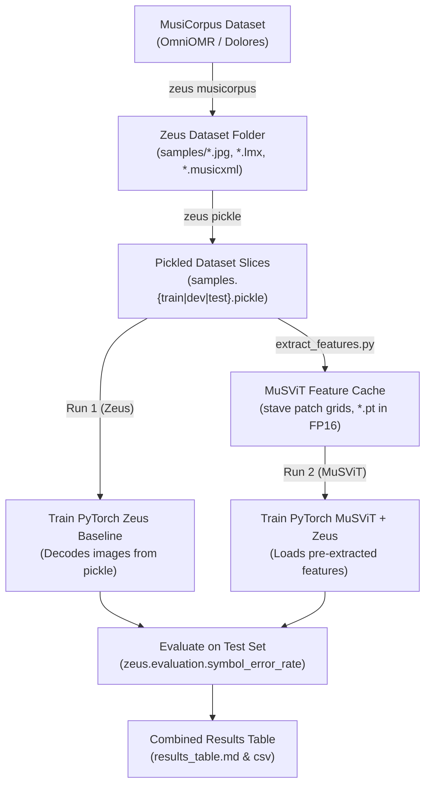

# MuSViT vs. Zeus Benchmark Comparison

This module provides a reproducible, controlled experiment comparing:
- **Run 1 (Zeus Baseline):** CNN-BiLSTM Encoder + Zeus Bahdanau Attention LSTM Decoder (trained from scratch).
- **Run 2 (MuSViT + Zeus):** Pre-trained MuSViT Vision Transformer Feature Extractor + Zeus Bahdanau Attention LSTM Decoder.

Both runs share the **exact same decoder architecture, random seed, training/validation/test splits, learning rate schedule, optimizer, and evaluation metrics**.

---

## 1. Unified Zeus Workflow

The workflow strictly follows the reference Zeus repository implementation:



---

## 2. Dataset Preparation: Convert & Pickle

The dataset preparation converts MusiCorpus datasets (like OmniOMR and Dolores) into Zeus format and bundles them into fast binary `.pickle` files.

Both steps run the embedded Zeus modules (`zeus/`) through `python -m musvit_zeus_comparison.zeus`, so the original Zeus package is not needed.
They need the `linearized-musicxml` package from `requirements.txt`. Run them from the repository root.

### Understanding `splits.json` & Split Isolation
In MusiCorpus datasets, train/val/test splits are defined **at the piece/page level** in a `splits.json` file in the dataset root:
```json
{
  "train": ["piece_id_1", "piece_id_2", ...],
  "dev": ["piece_id_3", ...],
  "test": ["piece_id_4", ...]
}
```
*(Note: Zeus accepts `"dev"`, `"val"`, or `"validation"`).*

### Step 1: Convert MusiCorpus to Zeus Format
Run the `musicorpus` command for each dataset. This applies invisible clef/key normalization and creates a `samples.<split>.txt` for each split in `splits.json` (plus `samples.all.txt`):

```bash
# Convert OmniOMR
python -m musvit_zeus_comparison.zeus musicorpus \
    --input datasets/UFAL.OmniOMR \
    --output datasets/omniomr \
    --take-staves

# Convert Dolores
python -m musvit_zeus_comparison.zeus musicorpus \
    --input datasets/CVC.Dolores \
    --output datasets/dolores \
    --take-staves
```

The split files are named after the keys of `splits.json`; OmniOMR and Dolores call the dev split `validation`, giving `samples.validation.txt`.
Staves whose MusicXML cannot be converted to LMX are logged and skipped (e.g. about 3% of the OmniOMR staves on a 6-page test, due to invisible mid-staff clefs).
The raw MusiCorpus folders can stay in `datasets/`: only folders containing pickled splits are treated as datasets by the training and extraction scripts.

### Step 2: Pickle the Slices
Bundle each split's loose images and LMX files into single `.pickle` files, written next to the `.txt` files:

```bash
# Pickle OmniOMR
python -m musvit_zeus_comparison.zeus pickle \
    datasets/omniomr/samples.train.txt \
    datasets/omniomr/samples.validation.txt \
    datasets/omniomr/samples.test.txt

# Pickle Dolores
python -m musvit_zeus_comparison.zeus pickle \
    datasets/dolores/samples.train.txt \
    datasets/dolores/samples.validation.txt \
    datasets/dolores/samples.test.txt
```

### How Splits Work With Multiple Datasets
All datasets live as subfolders of one directory (default `datasets/`), e.g. `datasets/omniomr/` and `datasets/dolores/`, each with its own pickled splits.
- **Predefined splits only:** every split is read from the dataset's own `samples.{train,dev,test}.pickle`; nothing is re-split randomly. Because splits are assigned at the page/piece level, staves from the same page never cross splits.
- **Free selection per split:** training, validation and test can each combine any datasets, and they may differ (e.g. train on OmniOMR + Dolores, validate on OmniOMR, test on both).
- **Unified Token Vocabulary:** Built from the combined training split, ensuring all grammar tokens of the training datasets are indexed.

---

## 3. Feature Pre-Extraction for MuSViT (Run 2)

Extracts visual features from the pickled stave images with pre-trained MuSViT, preparing each stave as the MuSViT documentation prescribes:
1. The stave image is resized to **1024 x 64** (W x H), ignoring its aspect ratio.
2. It is pasted at the top of a white **1024 x 1024** canvas, the input size MuSViT was pre-trained on (no normalization).
3. Only the patch rows covering the stave are kept: with 16 px patches, a 64 px stave covers the top **4 of the 64 patch rows**, giving a `(4, 64, 768)` grid per stave. The rows of the white padding are cut away.

```bash
# All splits of all datasets in datasets/:
python -m musvit_zeus_comparison.extract_features \
    --dataset-dir datasets \
    --output-dir feature_cache \
    --stave-height 64 \
    --precision float16 \
    --batch-size 8 \
    --num-workers 4 \
    --device cuda

# Only some datasets (names of subfolders of --dataset-dir, dataset folders, or .pickle files):
python -m musvit_zeus_comparison.extract_features --datasets omniomr dolores
```

`--stave-height` sets the height staves are resized to, as a multiple of 16 (the patch size); the number of kept patch rows is `height / 16`.
64 follows the MuSViT documentation. 96 is closer to the median aspect ratio of OmniOMR staves (about 10:1, whereas 1024 x 64 is 16:1), at 1.5x the cache size.
The compute per stave is the same for every height, since MuSViT always processes the whole 1024 x 1024 canvas.

Speed: `--num-workers` processes decode and resize the images ahead of the GPU, and only the stave band is sent to the GPU, where the white canvas is added.
`--tf32` runs the matrix multiplications on the TF32 tensor cores of Ampere and newer GPUs (A16, A4000, L4, ...). It is several times faster but slightly less precise (a 10-bit mantissa, like the FP16 storage), so features extracted with and without it differ slightly. Use one setting for a whole cache.

Features are stored per dataset and setting as `feature_cache/<dataset>/stave<height>_<precision>/<sample_name>.pt`, since sample names are only unique within a dataset; several heights can be cached side by side.
In FP16, a stave takes `height / 16 x 64 x 768 x 2` bytes, i.e. ~393 KB at height 64 (~3.9 GB for 10,000 staves).
Extraction resumes after an interruption and skips already-extracted samples.
*(Caches written by earlier versions, with square-resized staves and vertical pooling, are not used any more and need to be re-extracted.)*

The MuSViT model is gated on Hugging Face: accept its terms on the model page and provide a token via `HF_TOKEN` or `--token`.

---

## 4. Training

Both models train on the exact same pickled slices, using the same hyperparameters matching Zeus (`--learning-rate 1e-3`, `--lr-decay cos`, `--optimizer adam`, `--batch-size 32`):

### Selecting Datasets

| Flag | Meaning |
| :--- | :--- |
| `--dataset-dir DIR` | Directory with the datasets as subfolders (default: `datasets`). |
| `--datasets A B ...` | Datasets used for all splits unless overridden (default: all datasets in `--dataset-dir`). |
| `--train A B ...` | Datasets whose `train` split is used for training (default: `--datasets`). |
| `--dev A B ...` | Datasets whose `dev` split is used for validation and checkpoint selection (default: `--datasets`, or the `--train` datasets if `--datasets` is not given). |
| `--test A B ...` | Datasets whose `test` split is used for testing (default: `--datasets`, or the `--train` datasets if `--datasets` is not given); `--test` without values skips testing. |

Each dataset is given as the name of a subfolder of `--dataset-dir`, a path to a dataset folder, or a path to a `.pickle` file.
For the dev split, `samples.val.pickle` and `samples.validation.pickle` are accepted as well.

```bash
# Everything in datasets/, for all splits:
python -m musvit_zeus_comparison.train --model zeus

# Train on OmniOMR + Dolores, validate on OmniOMR, test on both:
python -m musvit_zeus_comparison.train --model zeus \
    --train omniomr dolores \
    --dev omniomr \
    --test omniomr dolores
```

So `--train omniomr` alone trains, validates and tests on OmniOMR only.
When several test datasets are selected, the test SER is reported for their combination and for each dataset separately.

### Option A: Parallel SLURM Training on Cluster (Recommended)
Submit both jobs to run concurrently on separate GPUs.
*(The `run_zeus.slurm` / `run_musvit.slurm` job scripts are not part of this repository; they need to pass the dataset flags above.)*

```bash
# Submit Run 1: Zeus Baseline
sbatch run_zeus.slurm

# Submit Run 2: MuSViT + Zeus
sbatch run_musvit.slurm
```

Each job outputs its own results (`zeus_results.json` and `musvit_results.json`). Whichever job finishes second automatically merges both runs into `results_table.md` and `results_table.csv`, warning if the two runs used different dataset selections.

To monitor progress:
```bash
tail -f logs/slurm-zeus-baseline-*.out
tail -f logs/slurm-musvit-zeus-*.out
```

### Option B: Interactive CLI Execution

#### Run 1: Zeus Baseline
```bash
python -m musvit_zeus_comparison.train \
    --model zeus \
    --datasets omniomr \
    --epochs 200 \
    --batch-size 32 \
    --learning-rate 1e-3 \
    --lr-decay cos \
    --evaluation-each 10 \
    --output-dir experiment_results \
    --device cuda
```

#### Run 2: MuSViT + Zeus
```bash
python -m musvit_zeus_comparison.train \
    --model musvit \
    --datasets omniomr \
    --feature-cache-dir feature_cache \
    --feature-stave-height 64 \
    --feature-layout columns \
    --feature-precision float16 \
    --epochs 200 \
    --batch-size 32 \
    --learning-rate 1e-3 \
    --lr-decay cos \
    --evaluation-each 10 \
    --output-dir experiment_results \
    --device cuda
```

Before any training starts (also before the Zeus run of `--model compare`), it is checked that MuSViT features of all selected samples have been extracted with the given `--feature-stave-height` and `--feature-precision`.
With `--model compare`, the results are exported after each run, so a finished Zeus run is kept even if the MuSViT run fails.

`--feature-layout` decides how the `(rows, 64, 768)` patch grid of a stave becomes the encoder's input sequence:
- `columns` (default): one timestep per patch column, with the rows of that column concatenated, i.e. `(64, rows x 768)`. This keeps the vertical position (pitch) of every patch, like the Zeus encoder flattening height x channels per column.
- `raster`: the row-major patch sequence of the MuSViT documentation (`flatten(1, 2)`), i.e. `(rows x 64, 768)`.

### Training Speed
The following are on by default and do not change what is computed (beyond floating-point rounding):
- **Length-bucketed batches:** the decoder runs for the longest transcription of a batch, so training batches are formed from pools of `--length-bucket-batches` (default 50) batches sorted by transcription length, and the batches are then shuffled. On the OmniOMR + Dolores length distribution, this cuts the decoder steps spent on padding from about 50% to a few percent. `--length-bucket-batches 1` gives plain random batches. Evaluation batches are sorted by length, and predictions are put back in dataset order.
- **TF32 matrix multiplications** on Ampere and newer GPUs (A16, A4000, L4, ...) for the decoder LSTM cell, the attention and the projections. PyTorch already uses TF32 for convolutions and cuDNN LSTMs by default. `--no-tf32` computes them in full FP32.
- **Fused Adam / AdamW** on CUDA, **pinned memory** with asynchronous copies to the GPU, and **persistent DataLoader workers**, which are not re-forked for every epoch.
- **No waiting for the GPU** after every batch: losses are accumulated on the GPU, sequence lengths stay on the CPU for packing, and greedy decoding checks for finished sequences only every 8 steps.

`--preload-features` reads all MuSViT feature files into RAM once (~0.4 MB per stave at height 64, ~4.6 GB for OmniOMR + Dolores) instead of from disk in every epoch, which helps on slow (e.g. network) filesystems.
The MuSViT-only run drops the stave images after loading, since it only uses the extracted features.

### Checkpoints and Resuming
- `<model>_best.pt` is the checkpoint with the lowest validation SER (evaluated every `--evaluation-each` epochs). With `--evaluation-each 0`, the lowest validation loss is used instead.
- `<model>_latest.pt` is written after every epoch. Both hold the model, optimizer and RNG state, the vocabulary and the training history.
- `--resume auto` continues from `<model>_latest.pt` exactly where training stopped (the same losses as an uninterrupted run, for any `--num-workers`); `--resume <path.pt>` continues from a given checkpoint (single `--model` only). `--epochs` may be raised when resuming; the cosine schedule follows the new value.
- `--eval-only` evaluates `<model>_best.pt` (or the checkpoint given by `--resume`) without training.
- `--max-gen-length` defaults to 1.2x the longest training transcription; a warning is printed if dev/test transcriptions are longer.

---

## 5. Evaluation & Results

Evaluation uses `zeus.evaluation.symbol_error_rate` directly:
1. **Validation SER:** Evaluated every `--evaluation-each` epochs during training; it selects the best checkpoint.
2. **Final metrics:** Validation loss, token accuracy, validation SER and test SER are all reported for the selected checkpoint.

Results are printed to stdout and saved in `experiment_results/`:
- `results_table.md` (Markdown format)
- `results_table.csv` (Spreadsheet format)
- `zeus_results.json`, `musvit_results.json` (per run, including the dataset selection)

Example output (illustrative numbers):

| Model Run | Encoder | Enc Params | Dec Params | Total Params | Best Epoch | Val Loss | Token Acc (%) | Val SER (%) | Test SER (%) | Train Time (s) |
| :--- | :--- | :--- | :--- | :--- | :--- | :--- | :--- | :--- | :--- | :--- |
| **Zeus Baseline (Run 1)** | CNN-BiLSTM | 851,200 | 1,185,420 | 2,036,620 | 180 | 0.8241 | 82.15% | 18.42% | 19.10% | 145.2s |
| **MuSViT + Zeus (Run 2)** | MuSViT + Adapter | 394,496 | 1,185,420 | 1,579,916 | 150 | 0.5120 | 89.64% | 11.20% | 11.85% | 42.1s |

With several test datasets, a `Test SER <dataset> (%)` column is added for each.
Encoder parameters of the MuSViT run exclude the frozen MuSViT backbone, and its training time excludes feature extraction.

### Evaluating checkpoints on an independent dataset

To compare checkpoints after changing the training splits, convert an independent
MusiCorpus dataset to Zeus pickles and evaluate its fixed test split:

```bash
python -m musvit_zeus_comparison.evaluate_checkpoints \
    --dataset datasets/dolores_small \
    --checkpoint old=/models/zeus_old.pt \
    --checkpoint new=/models/zeus_new.pt \
    --model-type old=zeus \
    --model-type new=zeus \
    --device cuda \
    --output results/dolores_small.json
```

`--model-type` defaults to `zeus`; use `musvit` for MuSViT checkpoints and
provide the matching feature-cache options. The evaluator loads each checkpoint's
vocabulary and hidden dimensions, evaluates `samples.test.pickle`, and reports
SER for the same samples. A checkpoint made by incompatible model code or with
different tensor shapes fails explicitly rather than producing a misleading score.

---

## 6. Directory Layout

```
musvit_zeus_comparison/
├── __init__.py          # Package exports
├── models.py            # ZeusEncoder, MusvitEncoder, ZeusDecoder, CombinedOMRModel
├── dataset.py           # In-memory ZeusDatasetSample loader, TokenVocabulary, StaveCollate
├── extract_features.py  # MuSViT feature extractor (padded 1024x1024 canvas, stave patch rows, FP16)
├── train.py             # Main trainer & evaluator with automated table generation
├── zeus/                # Embedded Zeus core modules (data, evaluation, musicorpus) and
│                        #   their CLI: python -m musvit_zeus_comparison.zeus musicorpus|pickle
└── README.md            # Documentation
```
